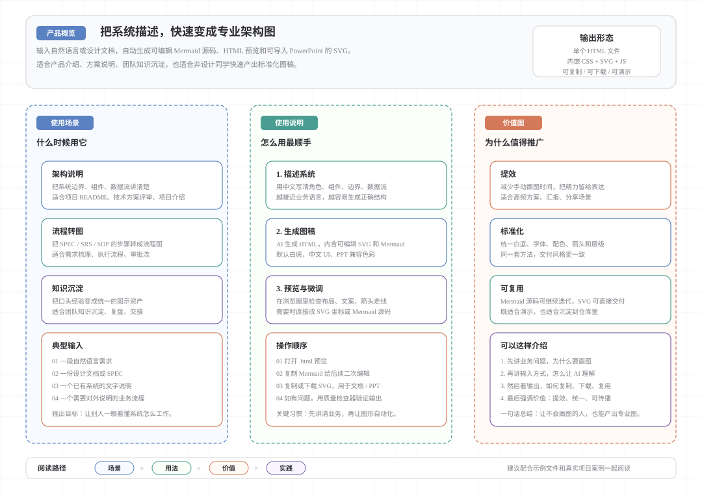

# Architecture Diagram Generator

**用 AI 生成专业架构图，只需要描述你的系统。**

安装到任何支持 Skill 的 AI 编程助手后，只需用自然语言描述系统架构，就能自动生成自包含的 HTML 文件，内嵌精美的 SVG 架构图。页面会保持白色背景、中文界面，并呈现简洁专业的视觉效果。

- **无需设计能力** —— 用中文描述你的架构即可
- **快速迭代** —— 增删组件、调整布局、更新样式
- **易于分享** —— 输出为单个 HTML 文件，无需额外软件
- **内置导出** —— Mermaid 源码 / 复制 SVG / 下载 SVG，一键完成
- **PowerPoint 兼容** —— 导出的 SVG 在 PowerPoint 中也能保持正确颜色


---

## 🚀 安装

### opencode

```bash
# 将 architecture-diagram/ 复制到 opencode skills 目录
cp -r architecture-diagram ~/.opencode/skills/
```

> 也可将 `architecture-diagram/` 放在项目本地，由 opencode 自动发现。

### Claude.ai

1. 下载 [`architecture-diagram.zip`](architecture-diagram.zip)
2. **自定义** → **技能** → **+ 创建技能** → **上传技能**
3. 选择 zip 文件，启用技能

### Claude Code CLI

```bash
unzip architecture-diagram.zip -d ~/.claude/skills/
```

### 其他 AI 助手

将 `architecture-diagram/` 放入对应助手的 skill 目录即可。

---

## 📸 示例

建议直接以 [architecture-diagram-overview.svg](examples/architecture-diagram-overview.svg) 作为统一示例，它整合了使用场景、使用说明和价值图，适合作为培训材料和文档入口。

---

## 📤 导出

打开生成的 HTML 文件后，使用顶部工具栏：

| 按钮 | 功能 |
|------|------|
| **Mermaid** | 复制可编辑的 Mermaid 源码 |
| **复制 SVG** | 复制矢量 SVG 到剪贴板 |
| **下载 SVG** | 下载 `.svg` 矢量文件 |

---

## ✨ 特性

- **白色简洁主题** —— 纯白背景，白色卡片容器，极浅阴影
- **语义化配色** —— 低饱和度填充 + 高饱和度描边，视觉舒适
- **Mermaid 源码可编辑** —— 每个图都附带隐藏的 Mermaid 定义块
- **SVG 矢量输出** —— 高清无限放大，适合文档和幻灯片
- **中文界面** —— Microsoft YaHei 字体，全中文 UI
- **自包含 HTML** —— 所有 CSS 和 JS 内嵌，无需联网加载
- **正交绕行布线** —— 箭头自动避让组件，无交叉
- **质量检查工具** —— Python 脚本验证 SVG 质量
- **PowerPoint 兼容** —— SVG 使用十六进制颜色，拖入 PPT 不变黑

---

## 🎨 配色方案

> SVG 中一律使用十六进制颜色（`#xxxxxx`）或 `rgba()`，不兼容 OKLCH 的软件（如 PowerPoint）导入后颜色正常。OKLCH 仅在 HTML 的 CSS 中使用。

组件语义色：

| 组件类型 | 填充 | 描边 |
|---------|------|------|
| 前端 / 入口 | `#eaf0fa` | `#5a82c2` |
| 后端 / 核心 | `#e2f1ed` | `#4a9e91` |
| 数据库 / 存储 | `#ede6f5` | `#7a62a8` |
| 云服务 / 外部 API | `#e6edf7` | `#5a87c2` |
| 安全 / 认证 | `#fce8e0` | `#d47a5a` |
| 插件 / 消息总线 | `#e8f2e2` | `#72a44e` |
| 外部 / 通用 | `#efeff1` | `#86868c` |

---

## 📦 项目结构

```
architecture-diagram/
├── SKILL.md                      # 技能指令（核心）
├── resources/
│   ├── template.html             # 输出模板
│   └── routing.js                # SVG 坐标路由参考
├── scripts/
│   └── svg_quality_checker.py    # 质量检查工具
└── tests/
    └── test_svg_quality_checker.py
```

---

## 📐 输出结构

```
┌─────────────────────────────────────────┐
│  [脉冲点] 项目名称架构图  [Mermaid|复制 SVG|下载 SVG] │
├─────────────────────────────────────────┤
│  [项目简介 · 关键特性 · 技术栈]           │
├─────────────────────────────────────────┤
│  ┌─────────────────────────────────┐   │
│  │          SVG 架构图              │   │
│  │  组件框 + 箭头 + 图例 + 层边界   │   │
│  └─────────────────────────────────┘   │
└─────────────────────────────────────────┘
```

---

## 🔧 质量检查

```bash
# 检查 HTML 文件
python scripts/svg_quality_checker.py path/to/diagram.html

# 检查 SVG 文件
python scripts/svg_quality_checker.py path/to/diagram.svg

# 发布模式（警告视为错误）
python scripts/svg_quality_checker.py --publish path/to/diagram.html
```

---

## 📘 能力概览图

这张图可直接用于产品介绍、能力展示和文档说明，也适合作为 README 中的能力概览图。



图中将「使用场景」「使用说明」和「价值图」整合到一页，便于快速理解其适用范围、使用方式和实际价值。

---

## 🛠 技术细节

| 项目 | 说明 |
|------|------|
| 输出格式 | 自包含 HTML（内联 CSS + SVG） |
| SVG viewBox | 默认 1000px 宽，自适应缩放 |
| 字体 | Microsoft YaHei、PingFang SC |
| 背景色 | `#ffffff` |
| SVG 颜色格式 | `#hex` 或 `rgba()`（PPT 兼容） |
| 组件圆角 | `rx="6"`–`"7"` |
| 层级间距 | 最小 30px（水平）、40px（垂直） |
| 绕行规则 | L 形/U 形正交路径，避免对角线 |
| 导出方式 | Mermaid 源码、Clipboard API、Blob 下载 |

---
## 📝 许可证

MIT License —— 可自由使用、修改和分发。

## 👥 贡献

欢迎提交 Issue 或 PR。
